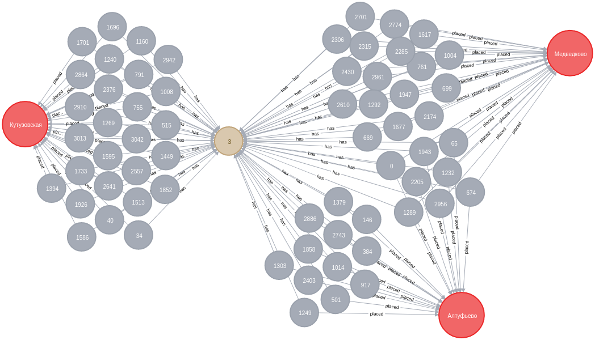

# Example of Neo4j usage

__Preamble__: *If you need graph view just store data as graph* 


```text
STEP 17668 , STEP TIMER 0.06 sec , GLOBAL TIMER 765.65 sec
```

How can I speed up my code (see my updates  at bottom):
* Place statements into one longtime transaction (+done)?
* Rewrite QL-statements (+done)?
* Anything else?

## Dataset

Just for fun open data [dataset](https://opengovdata.ru/dataset/sexwork).
But I convert it into really normalize flat CSV-file.

## Task

To represent data into graph mode.

## Description

I load dictionary data from my converted dataset and represent each cell as Neo4j-node object.
My class based approach help me to generate CQL-instructions dynamicly for Neo4j-nodes and Neo4j-relations.

## Run

```bash
python3 app/load_to_neo4j.py
```

See comments for additional info.

## As represenatation

### How many of them have same bооbs

```sqlite-sql
//Boobs count agregation
MATCH (n_id:id)-[]-(n_boobs:boobs)
WITH n_boobs, count(n_id) as count
RETURN DISTINCT n_boobs.value, count
ORDER BY count desc;
```
Return:

| n_boobs.value | count | 
|---------------|-------|
|2|2344|
|3|1476|
|4|486|
|1|425|
|5|229|
|6|66|
|7|30|
|8|18|
|10|6|
|11|3|
|9|3|
|12|1|


### Graph

Who with 3-bооbs is near 'Алтуфьево' or 'Кутузовская' or 'Медведково'


```sqlite-sql
MATCH (n_boobs:boobs)-[]-(n_id:id)-[]-(n_metro:metro)
WHERE n_boobs.value = 3 AND n_metro.name in ['Алтуфьево', 'Кутузовская', 'Медведково']
RETURN n_boobs, n_id, n_metro
```

Return:




## But what I want?

As you see on run log the speed of data insert is slow, very very slow.

```text
...
STEP 3276 , STEP TIMER 0.11 sec , GLOBAL TIMER 259.74 sec
STEP 3277 , STEP TIMER 0.04 sec , GLOBAL TIMER 259.79 sec
STEP 3278 , STEP TIMER 0.04 sec , GLOBAL TIMER 259.82 sec
...
```

On row 3276 time for data insert is **0.11** sec. 

```text
...
STEP 17667 , STEP TIMER 0.12 sec , GLOBAL TIMER 1460.87 sec
STEP 17668 , STEP TIMER 0.13 sec , GLOBAL TIMER 1461.00 sec
...
```

On row 17668 time for data insert is **0.13** sec. 

**How can I speed up my code?**
* Place statements into one longtime transaction?
* Rewrite QL-statements?
* Anything else?

### Update of code 2019.12.11 (twice as fast)
 
My code become twice as fast!!! :)

```text
STEP 17667 , STEP TIMER 0.06 sec , GLOBAL TIMER 765.59 sec
STEP 17668 , STEP TIMER 0.06 sec , GLOBAL TIMER 765.65 sec
```

On row 17668 time for data insert is **0.06** sec. And new `GLOBAL TIMER` **765.65** sec. vs old `GLOBAL TIMER` **1461.00** sec.

So (compare my old and last git commits):
* I place statement to one transaction ( commit after every 1000 rows from dataset)
* I rewrite QL-statement for MergeOrCreate (like SQL - InsertOrUpdate)

But I think it is still slow. How about you?
* Anything else?

Best regards.


